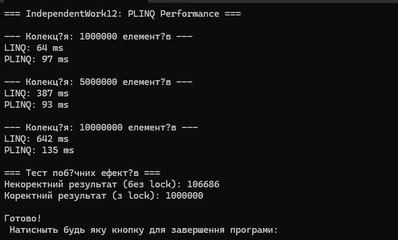

# IndependentWork12 — PLINQ: дослідження продуктивності та безпеки

##  Опис проєкту
Цей проєкт є виконанням **Самостійної роботи №12** з теми  
**PLINQ (Parallel LINQ): продуктивність та безпека паралельної обробки даних**.

Програма порівнює швидкодію LINQ і PLINQ на великих наборах даних, а також демонструє можливі побічні ефекти при паралельній роботі та їх правильне вирішення.

---

##  Мета роботи
- Дослідити переваги та недоліки PLINQ у порівнянні зі звичайним LINQ.  
- Виміряти продуктивність обох підходів при роботі з великими обсягами даних.  
- Виявити потенційні проблеми безпеки, пов'язані з побічними ефектами в PLINQ.  
- Вивести висновки щодо доцільності використання PLINQ у реальних задачах.

---

##  Проведені експерименти

###  Розміри колекцій
Тестування проводилося на трьох обсягах даних:

- **1 000 000 елементів**
- **5 000 000 елементів**
- **10 000 000 елементів**

Колекція: `List<int>`  
Дані — випадкові числа від 1 до 10 000.

---

##  Обчислювально інтенсивна операція
Для навантаження CPU була використана складна операція:  
###  Перевірка числа на простоту (`IsPrime()`)  
Після перевірки результат множився на `2`.

Це гарантувало достатнє навантаження, щоб оцінити реальні переваги PLINQ.

---

### Вивід в консоль:
 

---

##  Порівняння продуктивності LINQ та PLINQ

Для вимірювання часу використовувався:

```csharp
System.Diagnostics.Stopwatch
