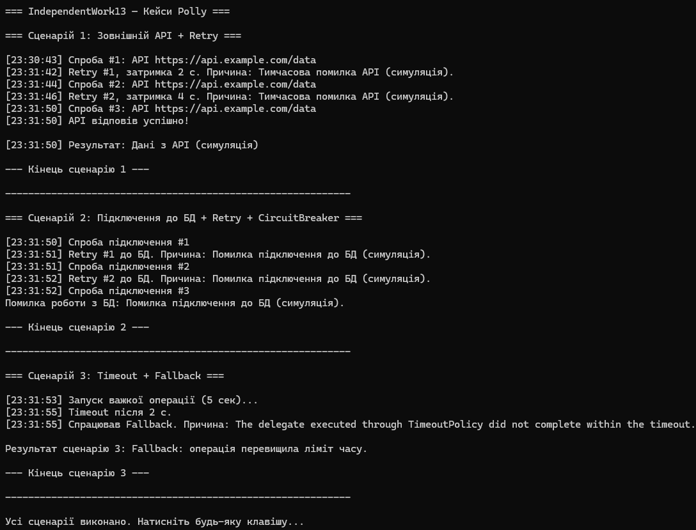

# IndependentWork13 — Кейси Polly / Retry / CircuitBreaker / Timeout

##  Опис проєкту
Цей проєкт є виконанням **Самостійної роботи №13**, присвяченої бібліотеці **Polly** — інструменту для підвищення відмовостійкості .NET-застосунків.

У роботі розглянуто **3 реальні сценарії**, де використання Polly допомагає впоратися з нестабільністю зовнішніх API, бази даних та довготривалими операціями.

---

#  Мета роботи
- Дослідити реальні сценарії, де виникають помилки або нестабільність.  
- Застосувати політики Polly: **Retry**, **Circuit Breaker**, **Timeout**, **Fallback**.  
- Імітувати помилки у C# та продемонструвати логування.  
- Зробити детальні висновки щодо переваг Polly.

---

#  Обрані сценарії
У роботі розглянуто три реальні сценарії:

1. **Нестабільний зовнішній API** -> Retry (з експоненційною затримкою)  
2. **Проблеми з підключенням до бази даних** -> Retry + Circuit Breaker  
3. **Операція, що виконується занадто довго** -> Timeout + Fallback  

---

#  Сценарій 1: Виклик зовнішнього API, який тимчасово недоступний  
##  Проблема
Зовнішні API часто повертають помилки:  
- перевантаження  
- тимчасова недоступність  
- нестабільний інтернет  

Такі помилки зазвичай короткочасні, і проста повторна спроба вже дає успіх.

##  Обрана політика Polly
**Retry з експоненційною затримкою**

Причина вибору:  
Експоненційна пауза дозволяє “розвантажити” сервер та зменшує ризик постійних помилок.


### Вивід в консоль:
 


##  Код

```csharp
using Polly;
using System.Net.Http;

int apiAttempts = 0;

string CallExternalApi()
{
    apiAttempts++;
    Console.WriteLine($"API attempt #{apiAttempts}");

    if (apiAttempts <= 2)
        throw new HttpRequestException("Temporary API error!");

    return "API response data";
}

var retryPolicy = Policy
    .Handle<HttpRequestException>()
    .WaitAndRetry(
        retryCount: 3,
        sleepDurationProvider: attempt => TimeSpan.FromSeconds(Math.Pow(2, attempt)),
        onRetry: (exception, delay, attempt, context) =>
        {
            Console.WriteLine($"Retry #{attempt}, waiting {delay.TotalSeconds}s");
        });

try
{
    string result = retryPolicy.Execute(() => CallExternalApi());
    Console.WriteLine($"Final result: {result}");
}
catch
{
    Console.WriteLine("All retries failed.");
}
