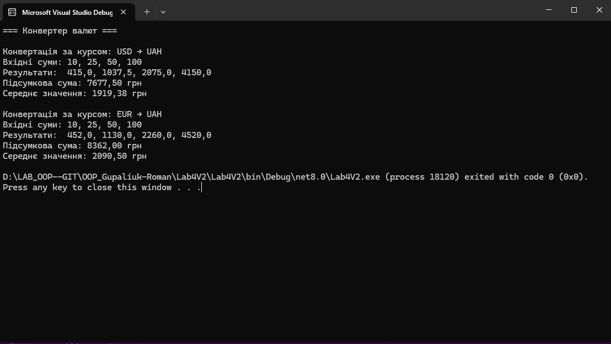

# Лабораторна робота №4
## Тема:
Абстракції та інтерфейси. Композиція та агрегація.

## Мета:
Навчитися створювати абстрактні класи та інтерфейси, будувати ієрархії класів із використанням композиції та агрегації, реалізовувати прості обчислення, демонструвати гнучкість і повторне використання коду.

---

## Варіант №2 — Конвертер валют

### Умова:
- **Інтерфейс:** `IConverter`  
- **Реалізації:** `UsdToUah`, `EurToUah`  
- **Обчислення:** перетворення масиву значень, середня й підсумкова сума.  
- Використати композицію або агрегацію між класами.

---

## Опис виконання:
- Створено інтерфейс **`IConverter`**, який задає метод `Convert()` і властивість `CurrencyName`.  
- Реалізовано абстрактний клас **`CurrencyConverter`**, який визначає спільну логіку для всіх конвертерів.  
- Створено два класи:
  - **`UsdToUah`** — конвертація доларів у гривні.  
  - **`EurToUah`** — конвертація євро у гривні.  
- Клас **`CurrencyManager`** реалізує **композицію** — містить список конвертерів і керує виконанням усіх обчислень.  
- У програмі виконується:
  - конвертація масиву сум для кожного типу валют,  
  - обчислення підсумкової та середньої суми,  
  - вивід результатів у консоль.

---

## Приклад запуску програми:



---

## Висновок:
У ході виконання лабораторної роботи було реалізовано приклад використання **інтерфейсів**, **абстрактних класів**, **композиції** та **агрегації** в C#.  
Отримано практичні навички проєктування об’єктно-орієнтованих програм, які легко розширюються та підтримуються.  
Додати новий конвертер можна без зміни логіки основного коду — лише створивши новий клас, який реалізує `IConverter`.

---

## Контрольні запитання

**1. У чому різниця між абстрактним класом і інтерфейсом?**  
- **Інтерфейс** визначає тільки контракт (методи, властивості) без реалізації.  
- **Абстрактний клас** може містити як абстрактні, так і реалізовані методи.  
- Клас може реалізовувати кілька інтерфейсів, але успадковувати лише один абстрактний клас.

---

**2. Коли краще використовувати композицію, а коли наслідування?**  
- **Наслідування** — коли є природна ієрархія типів (“є вид”): `Cat` є `Animal`.  
- **Композиція** — коли один об’єкт містить інший як частину (“має”): `Car` має `Engine`.  
Композиція дає більшу гнучкість у зміні поведінки об’єктів.

---

**3. Як працює агрегація та чим вона відрізняється від композиції?**  
- **Агрегація** — слабкий зв’язок: об’єкти можуть існувати незалежно.  
- **Композиція** — сильний зв’язок: частини знищуються разом із головним об’єктом.

---

**4. Чи може клас реалізовувати кілька інтерфейсів одночасно?**  
Так, може. Це дозволяє класу поводитись як кілька типів одночасно:
```csharp
class SmartDevice : IPowerUsage, IConnectable, IUpdatable { ... }
